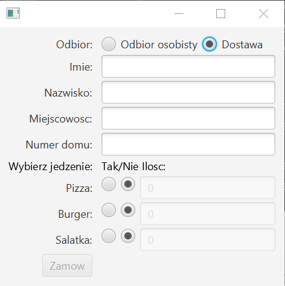
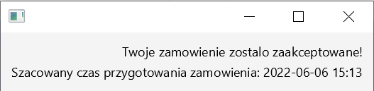

## Spis treści
1. [Główne informacje](#Główne informacje)
2. [Funkcjonalności aplikacji](#Funkcjonalności aplikacji)
    * [Przed złożeniem zamówienia](#Przed złożeniem zamówienia)
    * [Po złożeniu zamówienia](#Po złożeniu zamówienia)

## Główne informacje
Aplikacja do zamawiania jedzenia z wykorzystaniem języka Java oraz MVVM.

## Funkcjonalności aplikacji
Jest to prosta aplikacja do zamawiania jedzenia z wykorzystaniem Javy oraz MVVM.  
W aplikacji trzeba wybrać dany sposób odbioru: osobisty bądź dostawę.  
Następnie musimy wypełnić nasz informacje takie jak: Imię, Nazwisko, Miejscowość, Nr-domu.  
Oprócz tego możemy wybrać pomiędzy 3 posiłkami (pizzy, burgerem, salatka) czy chcemy je zamówić wraz z ich ilością jaka chcemy zamówic.  
Jeżeli wszystkie pola są wypełnione poprawie przycisk zamów będzie możliwy do wciśnięcia.  
Po wciśnięciu guzika zamów zostaniemy przeniesieni do nowego okna z potwierdzeniem naszego zamówienia oraz szacowanym czasem przygotowania.

### Przed złożeniem zamówienia

### Po złożeniu zamówienia
 